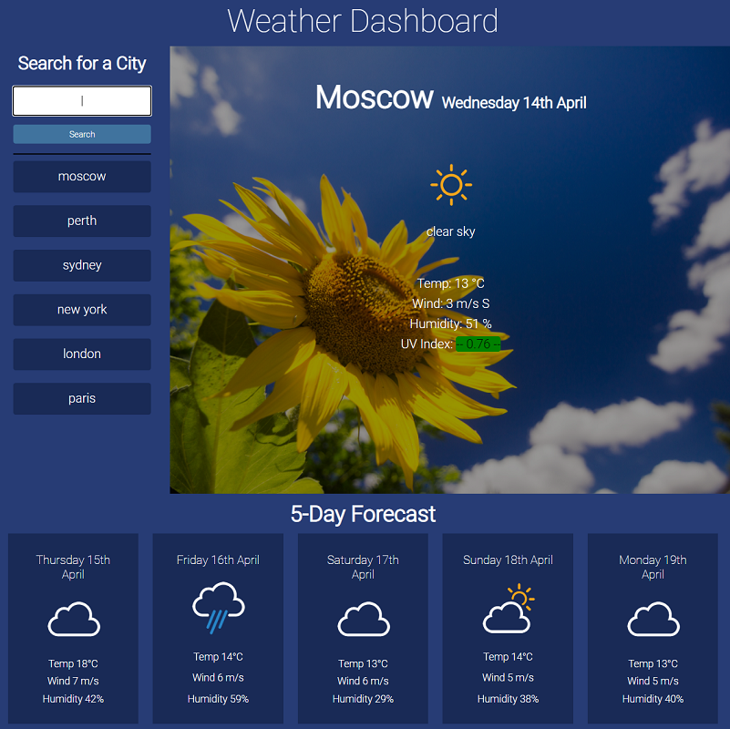

# Dynamic Weather Dashboard

## Client Requirements
- This client required a simple and intuitive weather application that could be used to check current and future city conditions, to allow him to plan his travel itinerary.  

- The client had specific criteria for the application.   

Below is the list of criteria 
1. Include a search history which is selectable.  
2. Current city conditions must include UV index with dynamic color indicator.  
3. Include a Five Day Forecast.  
4. Weather parametars to include, temperature, wind, humidity, an icon, uv index and city name and date.  
  

## Deployment  
- This Project has been deployed to Github and is live on Github pages.
 
- This is the link to the deployed webpage: https://brett-treweek.github.io/Simple-Weather-App/

- This is the link to the Github Repository tha contains the code: https://github.com/brett-treweek/Simple-Weather-App

- Custom fonts thanks to manifestinteractive. Check them out here https://github.com/manifestinteractive/weather-underground-icons 

 
